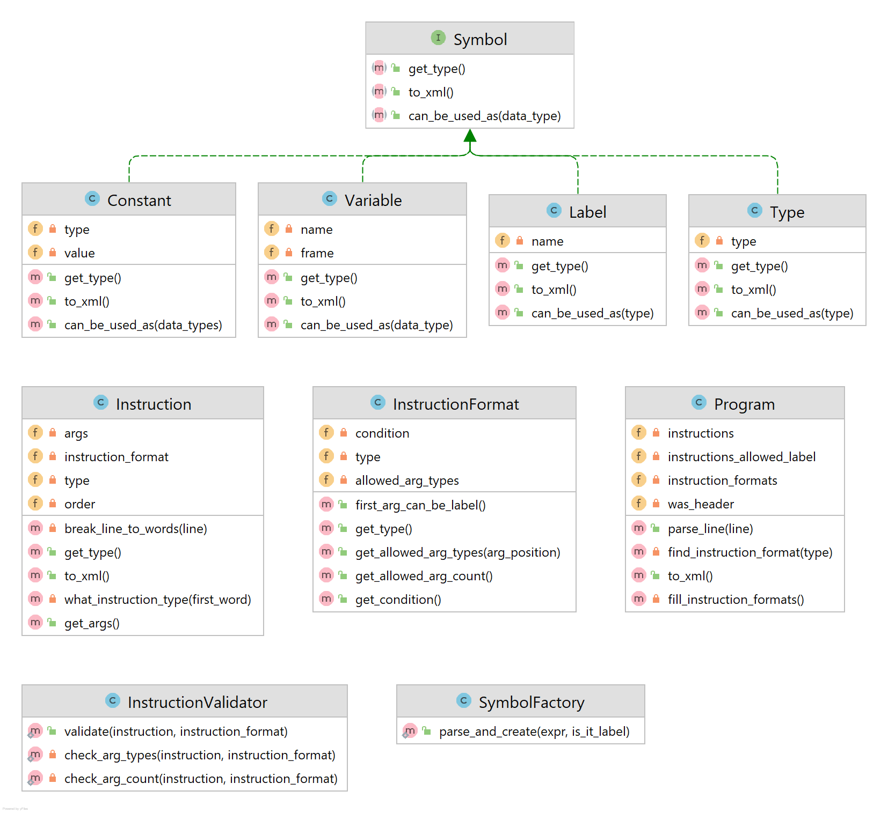

Implementační dokumentace k 1. úloze do IPP 2021/2022

Jméno a příjmení: Marián Ligocký

Login: xligoc04

## Parser pre jazyk IPPcode22

Cieľom programu parse.php je naparsovanie a syntaktická kontrola kódu v jazyku IPPcode22 a následné vygenerovanie XML
reprezentácie kódu. Vstupný kód sa načíta zo štandardného vstupu a XML kód sa vypíše na štandardný výstup. V prípade
chyby je kód chyby vrátený ako výstupný kód.

### Kontrola sématiky

Pri konštruovaní parseru som bral do úvahy aj kontrolu sématiky, ktorú je možné skontrolovať parserom. Som si vedomý, že
v zadaní táto informácia nie je uvedená a nie je uvedená ani žiadna chyba, ktorá sa má vypisovať v prípade sématických
chýb parseru, vraciam teda chybu 23. 

### Návrh

Využili sme objektovo orientovaný návrh, kde sme sa snažili zapúzdriť logiku do príslušných tried. Nepoužili sme žiadny
stavový automat, ale každý typ inštrukcie reprezentujeme ako povolené typy argumentov a kontrolnú funkciu (viac v sekcií
Validácia inštrukcie).



#### Spracovanie riadku

Spracovanie jedného riadka inštrukcie sa začína v triede `Program` v metóde `parse_line`, ktorá skontroluje hlavičku,
vytvorí nový objekt `Instruction`. Po vytvorení objektu nájde odpovedajúci formát pre inštrukciu a zavolá validáciu
inštrukcie.

#### Vytvorenie inštrukcie a symbolov

V konštruktore inštrukcie sa zistí druh inštrukcie a uloží sa napr. ako `INSTR_TYPE::PUSHS`. Následne sa
pomocou `SymbolFactory` vytvoria objekty pre všetky argumenty.

Jedná sa o návrhový vzor [**factory method**](https://refactoring.guru/design-patterns/factory-method). Rozhodli sme sa
ho implementovať kvôli sprehľadneniu vytvárania správneho objektu pre symbol. Symbol je rozhranie, ktoré je
implementované štyroma triedami: `Constant`, `Variable`, `Label` a `Type`. Na základe spracovania regulárnych výrazov
zistíme aký objekt by sme mali vytvoriť, ten vytvoríme a vrátime referenciu na neho. Takýmto spôsobom prenechávame
vytváranie symbolov samostatnej triede a sprehľadňujeme kód.

Príklad kontroly premennej pomocou regex výrazu.

```injectablephp
preg_match('/^(LF|GF|TF)@([_\-$&%*!?a-zA-Z][_\-$&%*!?\w]*)$/', $expr, $matches)
```

#### Validácia inštrukcie

Pre každý druh inštrukcie máme vytvorený formát, v ktorom sú jeho povolené typy a podmienková funkcia (použitá napr. na
zabezpečenie rovnakého typu druhého a tretieho parametru).

```injectablephp
new InstructionFormat(INSTR_TYPE::MOVE, [DATA_TYPE::VAR], [DATA_TYPE::BOOL, DATA_TYPE::INT, DATA_TYPE::NIL, DATA_TYPE::STRING], 
function(Instruction $instruction) {
            return true; // any condition 
});
```

Validácia inštrukcie sa vykonáva v triede  `InstructionValidator`, ktorá porovná inštukciu a jej povolený formát.

#### Vygenerovanie XML

Pre prácu s XML využívame knižnicu `SimpleXMLElement`, ale drvivá väčšina sa generuje ručne, pomocou funkcie `sprintf`.
Spustenie generovania XML kódu sa vykonáva priamo zavolaním metódy `$program->to_xml();`, ktorá vráti XML reprezentáciu
všetkých inštrukcií tak, že na nich volá opäť metódu `$instruction->to_xml()`. Inštrukcie zavolajú túto metódu aj nad
symbolmi a podľa druhu symbolu (konštanta/premenná/náveštie/typ) sa vráti xml reprezentácia. 